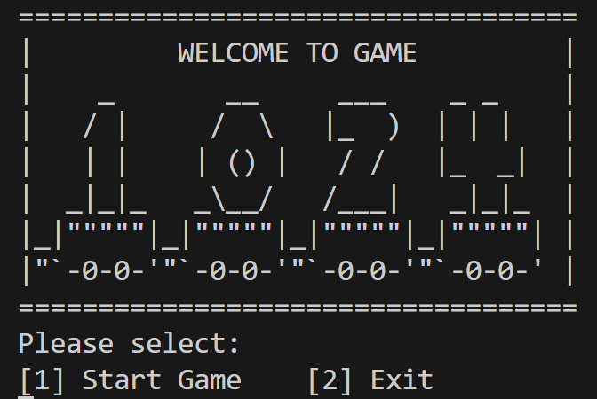
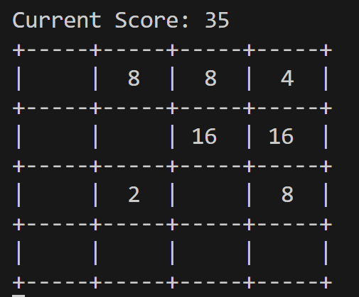

# game1024
1024 games with C++ code.

## platform support
Linux & Windows

# quick start
1. run  `sh build.sh`
2. open the excutable file `game1024`

## game target
move and merge the same number to reach "1024"!

## operation instruction
- move:`wsad`
- quit:`q`

# TODO

# example

